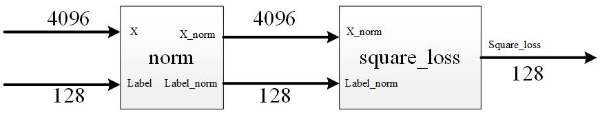

# ESE532fall2019_emulation
This code is to show you how to use simulation and emulation to debug your code.

## 1. Description
SDSoC is an excellent tool for SoC design. It excludes a lot of gluing logic design between hardware and software. The designers can focus on some high- level architecture design. However, it abstracts away some essential details, which is bad for debugging. Nevertheless, it offers you some methods, by which you can do some low-level debugging. Emulation is one of the useful tools, which we will focus on in the following sections.

## 2. Buffer Lock Example
This system is to use DMA to transfer data and labels into hardware and do some calculations and return the data back into DDR ram. We will use `hls:stream` data type to connect the module `norm` and `square_loss`. If you create a `vivado_HLS` project and do the C simulation, it should run without any errors. However, if you compile it in the SDSoC, you will get nothing when downloading it into the board.  

We can see the moudle `norm` is trying to send 4096 data X_norm and 128 data Label_norm to module `square_loss`. Here we intentionally set the module `sqaure_loss` to read data Label_norm first, so that a buffer lock shows up.

